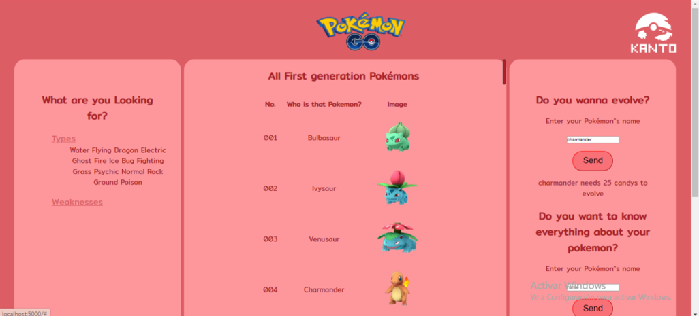
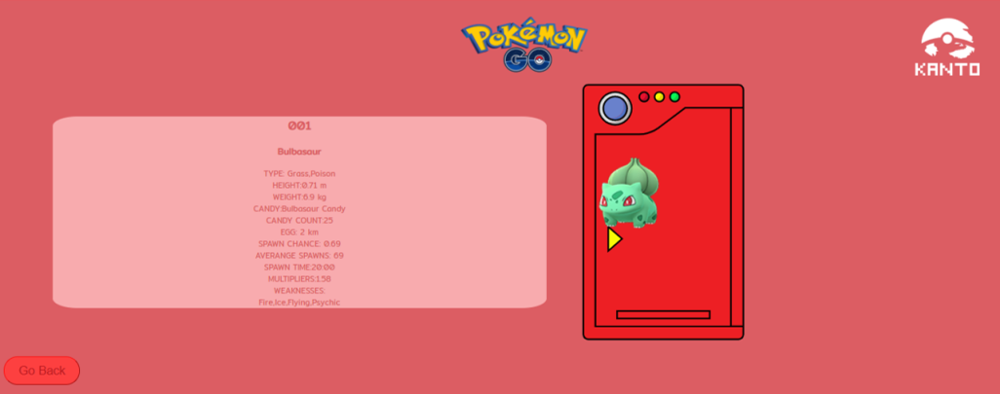
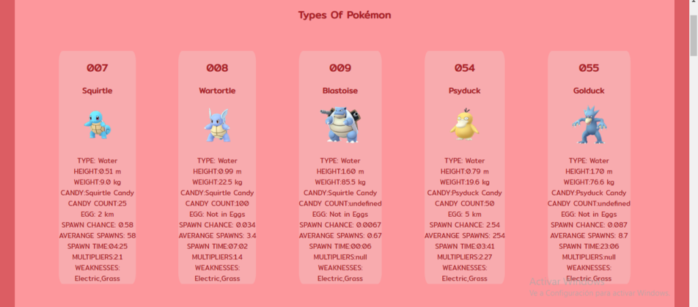
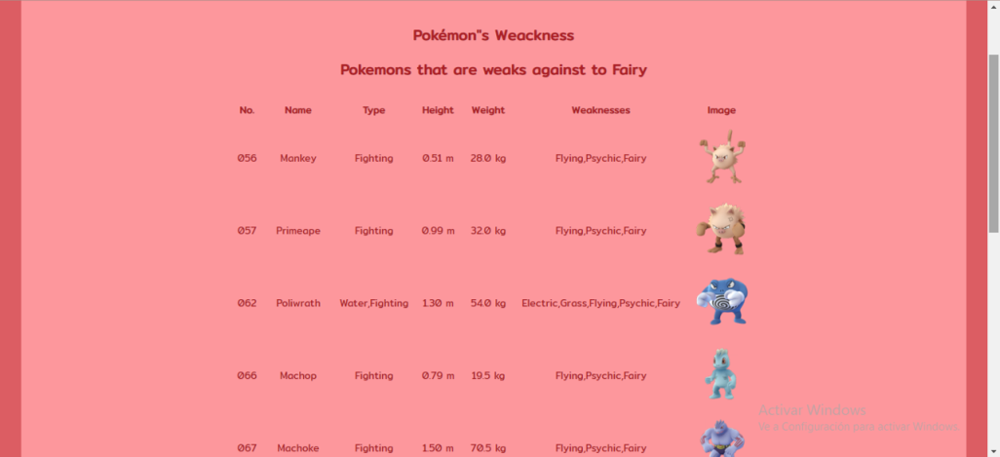
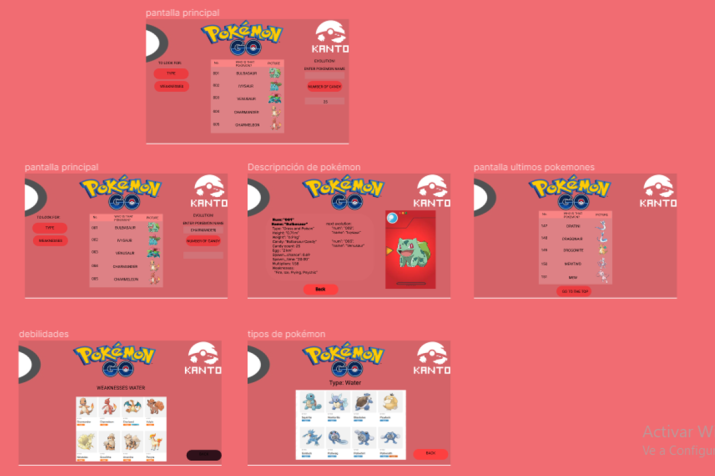
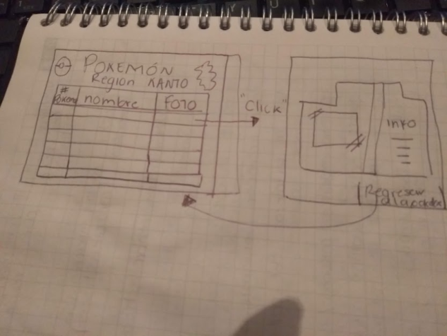
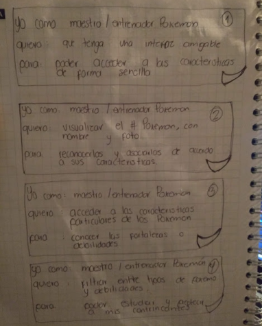
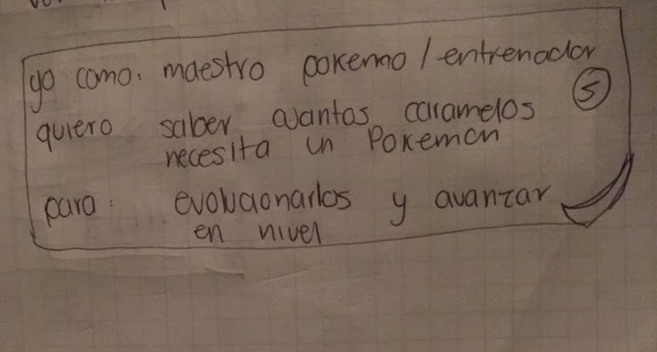

# Data Lovers Pokemon Go

## Proceso de Diseño

Nuestro proceso de diseño fue parecido al de cipher, solo que un poco más rápido pues ya teniamos
algo de conocimiento anterior. Seguimos los mismo pasos para lograr un diseño pensando en
nuestros usuario pedimos feedback de nuestro prototipo de baja fidelidad y complementamos.

Despues de tener el prototipo de baja fidelidad y tener un poco mas claro lo que queriamos y
como se veria, visitamos varias paginas relacionadas y notamos que varias de estas no tenian una
interfaz amigable y eran confusas, asi que tomamos ese descubrimiento como nuestra primera historia de usuario.

Pensamos que nuestra app soluciona los problemas de los maestros/entrenadores pokemon, pues nos muestra una tabla con los 151 pokemons de la region kanto con los elementos que ellos consideran
importantes (numero pokemon, nombre y una imagen).
Tambien mostramos por debilidades o tipos, esto les ayuda para conocer las fortalezas de su pokemon y poder estudiar y predecir a sus contrincantes.

Consideramos que los usuarios para poder evolucionar a su pokemon necesitarian saber cuantos dulces se requieren, asi que añadimos un apartado para consultar esa informacion y asi evolucionarlos y avanzar de nivel.

Por ultimo incluye un apartado para poder ver la especificaciones de los pokemons esto para conocer todo sobre su pokemon.

Liga mockup
https://www.figma.com/proto/Dg6OYTUK625lLm6F7IlSmT/Pokemon?node-id=0%3A1&scaling=min-zoom

## Historias de usuarios

### UX

- [ ✓] Diseñar la aplicación pensando y entendiendo al usuario.
- [ ✓] Crear prototipos para obtener feedback e iterar.
- [ ✓] Aplicar los principios de diseño visual (contraste, alineación, jerarquía).
- [ ] Planear y ejecutar tests de usabilidad.

### HTML y CSS

- [ ✓] Entender y reconocer por qué es importante el HTML semántico.
- [ ✓] Identificar y entender tipos de selectores en CSS.
- [ ] Entender como funciona `flexbox` en CSS.
- [ ✓] Construir tu aplicación respetando el diseño planeado (maquetación).

### DOM

- [✓ ] Entender y reconocer los selectores del DOM (querySelector | querySelectorAll).
- [ ✓] Manejar eventos del DOM. (addEventListener)
- [ ✓] Manipular dinámicamente el DOM. (createElement, appendchild, innerHTML, value)

### Javascript

- [ ✓] Manipular arrays (`filter` | `map` | `sort` | `reduce`).
- [ ✓] Manipular objects (key | value).
- [ ✓] Entender el uso de condicionales (`if-else` | `switch`).
- [ ✓] Entender el uso de bucles (`for` | `forEach`).
- [ ] Entender la diferencia entre expression y statements.
- [ ✓] Utilizar funciones (parámetros | argumentos | valor de retorno).
- [ ] Entender la diferencia entre tipos de datos atómicos y estructurados.
- [ ✓] Utilizar ES Modules (`import` | `export`).

### Pruebas Unitarias (testing)
- [ ] Testear funciones (funciones puras).

### Git y GitHub
- [ ✓] Ejecutar comandos de git (`add` | `commit` | `pull` | `status` | `push`).
- [ ✓] Utilizar los repositorios de GitHub (`clone` | `fork` | gh-pages).
- [ ✓] Colaborar en Github (pull requests).

### Buenas prácticas de desarrollo
- [ ✓] Organizar y dividir el código en módulos (Modularización).
- [ ✓] Utilizar identificadores descriptivos (Nomenclatura | Semántica).
- [ ✓] Utilizar linter para seguir buenas prácticas (ESLINT).

*

## Proceso de Diseño

Nuestro proceso de diseño fue parecido al de cipher, solo que un poco más rápido pues ya teniamos
algo de conocimiento anterior. Seguimos los mismo pasos para lograr un diseño pensando en
nuestros usuario pedimos _feedback_ de nuestro prototipo de baja fidelidad y complementamos.

Despues de tener el prototipo de baja fidelidad y tener un poco mas claro lo que queriamos y
como se veria, visitamos varias paginas relacionadas y notamos que varias de estas no tenian una
interfaz amigable y eran confusas, asi que tomamos ese descubrimiento como nuestra primera historia de usuario.

Pensamos que nuestra app soluciona los problemas de los maestros/entrenadores pokemon, pues nos muestra una tabla con los 151 pokemons de la region kanto con los elementos que ellos consideran
importantes (numero pokemon, nombre y una imagen).
Tambien mostramos por debilidades o tipos, esto les ayuda para conocer las fortalezas de su pokemon y poder estudiar y predecir a sus contrincantes.

Consideramos que los usuarios para poder evolucionar a su pokemon necesitarian saber cuantos dulces se requieren, asi que añadimos un apartado para consultar esa informacion y asi evolucionarlos y avanzar de nivel.

Por ultimo incluye un apartado para poder ver la especificaciones de los pokemons esto para conocer todo sobre su pokemon.

Liga mockup
https://www.figma.com/proto/Dg6OYTUK625lLm6F7IlSmT/Pokemon?node-id=0%3A1&scaling=min-zoom

## Historias de usuarios

### UX

- [ ✓] Diseñar la aplicación pensando y entendiendo al usuario.
- [ ✓] Crear prototipos para obtener _feedback_ e iterar.
- [ ✓] Aplicar los principios de diseño visual (contraste, alineación, jerarquía).
- [ ] Planear y ejecutar _tests_ de usabilidad.

### HTML y CSS

- [ ✓] Entender y reconocer por qué es importante el HTML semántico.
- [ ✓] Identificar y entender tipos de selectores en CSS.
- [ ] Entender como funciona `flexbox` en CSS.
- [ ✓] Construir tu aplicación respetando el diseño planeado (maquetación).

### DOM

- [✓ ] Entender y reconocer los selectores del DOM (querySelector | querySelectorAll).
- [ ✓] Manejar eventos del DOM. (addEventListener)
- [ ✓] Manipular dinámicamente el DOM. (createElement, appendchild, innerHTML, value)

### Javascript

- [ ✓] Manipular arrays (`filter` | `map` | `sort` | `reduce`).
- [ ✓] Manipular objects (key | value).
- [ ✓] Entender el uso de condicionales (`if-else` | `switch`).
- [ ✓] Entender el uso de bucles (`for` | `forEach`).
- [ ] Entender la diferencia entre expression y statements.
- [ ✓] Utilizar funciones (parámetros | argumentos | valor de retorno).
- [ ] Entender la diferencia entre tipos de datos atómicos y estructurados.
- [ ✓] Utilizar ES Modules (`import` | `export`).

### Pruebas Unitarias (_testing_)
- [ ] Testear funciones (funciones puras).

### Git y GitHub
- [ ✓] Ejecutar comandos de git (`add` | `commit` | `pull` | `status` | `push`).
- [ ✓] Utilizar los repositorios de GitHub (`clone` | `fork` | gh-pages).
- [ ✓] Colaborar en Github (pull requests).

### Buenas prácticas de desarrollo
- [ ✓] Organizar y dividir el código en módulos (Modularización).
- [ ✓] Utilizar identificadores descriptivos (Nomenclatura | Semántica).
- [ ✓] Utilizar linter para seguir buenas prácticas (ESLINT).

***
